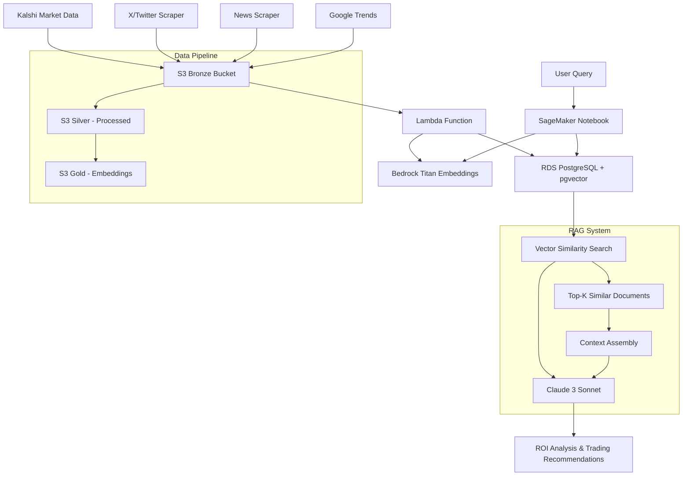

# 📊 Kalshi RAG Agent - AWS Pipeline

**Political prediction Kalshi Agent** using vector RAG to combine **Kalshi odds data** with **social sentiment analysis** for ROI-focused betting recommendations.

---

## 🏗️ Architecture Workflow Diagram

🛠️ Services Used
Service	Purpose	Configuration
AWS Lambda	Data processing & embedding gen.	Python 3.10, 512MB RAM, 15min timeout
Amazon Bedrock	LLM inference & embeddings	Titan Text V2, Claude 3 Sonnet
Amazon SageMaker	Interactive analysis	Jupyter notebooks with ml.t3.medium
Amazon S3	Data lake storage	Bronze / Silver / Gold buckets
Amazon RDS	Vector database	Aurora PostgreSQL + pgvector
Secrets Manager	DB credentials	Auto-rotation enabled

🔄 RAG Technique Used

Vector Similarity Search RAG

Embedding Model: Amazon Titan Text Embeddings V2 (1024 dimensions)

Vector Database: PostgreSQL with pgvector

Similarity Metric: Cosine distance (<=> operator)

Retrieval Method: K-NN search (top-30 similar documents)

Generation Model: Claude 3 Sonnet (via Bedrock)

Context Assembly: Hybrid — structured market data + unstructured sentiment

📋 Project Setup Steps
1. Infrastructure Setup
# Create S3 buckets
aws s3 mb s3://kalshi-bronze-anubh-001
aws s3 mb s3://kalshi-silver-anubh-001
aws s3 mb s3://kalshi-gold-anubh-001

# Create RDS Aurora PostgreSQL cluster (example)
aws rds create-db-cluster \
  --db-cluster-identifier kalshi-aurora-rds \
  --engine aurora-postgresql \
  --engine-version 15.4 \
  --master-username postgres

2. Database Setup
-- Enable pgvector extension
CREATE EXTENSION IF NOT EXISTS vector;

-- Create documents table
CREATE TABLE kalshi_documents (
    id SERIAL PRIMARY KEY,
    text TEXT,
    topic VARCHAR(500),
    date VARCHAR(50),
    embedding JSONB
);

-- Add unique constraint for upserts
ALTER TABLE kalshi_documents 
ADD CONSTRAINT unique_document UNIQUE (text, topic, date);

3. Lambda Function Deployment
# Package dependencies
pip install boto3 psycopg2-binary -t ./package
cd package && zip -r ../lambda-deployment.zip .
cd .. && zip -g lambda-deployment.zip lambda_function.py

# Deploy function
aws lambda create-function \
  --function-name kalshi-data-processor \
  --runtime python3.10 \
  --zip-file fileb://lambda-deployment.zip \
  --handler lambda_function.lambda_handler

4. Data Collection
# Run scrapers (examples)
python kalshi_scraper.py        # Market odds data
python x_scraper.py             # Social sentiment
python news_scraper.py          # News articles
python google_trends_scraper.py # Search trends

5. SageMaker Analysis
# Example: run a RAG query from a SageMaker notebook
result = kalshi_pure_vector_rag("New Jersey Governor Election")
print(json.dumps(result, indent=2))

🔐 Required IAM Permissions
Lambda Execution Role
{
  "Version": "2012-10-17",
  "Statement": [
    {
      "Effect": "Allow",
      "Action": ["s3:GetObject", "s3:PutObject"],
      "Resource": ["arn:aws:s3:::kalshi-*/*"]
    },
    {
      "Effect": "Allow",
      "Action": ["bedrock:InvokeModel"],
      "Resource": ["arn:aws:bedrock:*::foundation-model/amazon.titan-embed-text-v2:0"]
    },
    {
      "Effect": "Allow",
      "Action": ["rds-data:ExecuteStatement", "rds-data:BatchExecuteStatement"],
      "Resource": "arn:aws:rds:*:*:cluster:kalshi-aurora-rds"
    },
    {
      "Effect": "Allow",
      "Action": ["secretsmanager:GetSecretValue"],
      "Resource": "arn:aws:secretsmanager:*:*:secret:rds!cluster-*"
    }
  ]
}

SageMaker Execution Role
{
  "Version": "2012-10-17",
  "Statement": [
    {
      "Effect": "Allow",
      "Action": ["bedrock:InvokeModel"],
      "Resource": [
        "arn:aws:bedrock:*::foundation-model/amazon.titan-embed-text-v2:0",
        "arn:aws:bedrock:*::foundation-model/anthropic.claude-3-sonnet-20240229-v1:0"
      ]
    },
    {
      "Effect": "Allow",
      "Action": ["secretsmanager:GetSecretValue"],
      "Resource": "*"
    }
  ]
}

📊 Final Output (Sample ROI Analysis)
{
  "question": "New Jersey Governor Election",
  "roi_analysis": {
    "best_opportunity": "GOVPARTYNJ-25-R",
    "current_odds": 11.9,
    "implied_probability": 0.119,
    "true_probability_estimate": 0.25,
    "expected_roi_percentage": 109.24,
    "sentiment_momentum": "bullish",
    "market_assessment": "undervalued",
    "confidence": "medium",
    "key_insights": [
      "Social media sentiment shows growing support for Republican candidate",
      "Recent polling data suggests tightening race"
    ],
    "reasoning": "Market odds at 11.9% vs social sentiment indicating 25% true probability creates 109% ROI opportunity..."
  },
  "data_breakdown": {
    "kalshi_records": 15,
    "social_posts": 10,
    "total_matches": 30
  }
}

📈 Key Metrics

Data Sources: 1,215+ documents (491 Kalshi + 50 social + others)

Embedding Dimensions: 1024 (Titan Text V2)

Processing Speed: ~5.6 seconds for 13 social posts (example)

ROI Accuracy: Combines quantitative odds with qualitative sentiment

Update Frequency: Real-time via Lambda triggers

🚀 Usage Example
result = kalshi_pure_vector_rag("Trump 2024 election chances")
print(f"Best Bet: {result['roi_analysis']['best_opportunity']}")
print(f"Expected ROI: {result['roi_analysis']['expected_roi_percentage']}%")
print(f"Confidence: {result['roi_analysis']['confidence']}")

💡 Business Value

Market Inefficiency Detection — identifies mispriced betting opportunities

Sentiment-Driven Alpha — uses social media as early signal source

Automated Analysis — processes multiple sources in parallel

Risk Assessment — returns confidence and reasoning for decisions

Scalable Architecture — serverless design handles variable workloads

Tech Stack: Python, AWS (Lambda, Bedrock, SageMaker, S3, RDS), PostgreSQL + pgvector, Selenium, Claude 3, Titan Embeddings

⚠️ Disclaimer

This project interacts with prediction markets and uses social data; ensure you follow legal/regulatory requirements and Kalshi's terms of service. Use financial/trading recommendations responsibly — this repository is for educational / research purposes and not financial advice.
